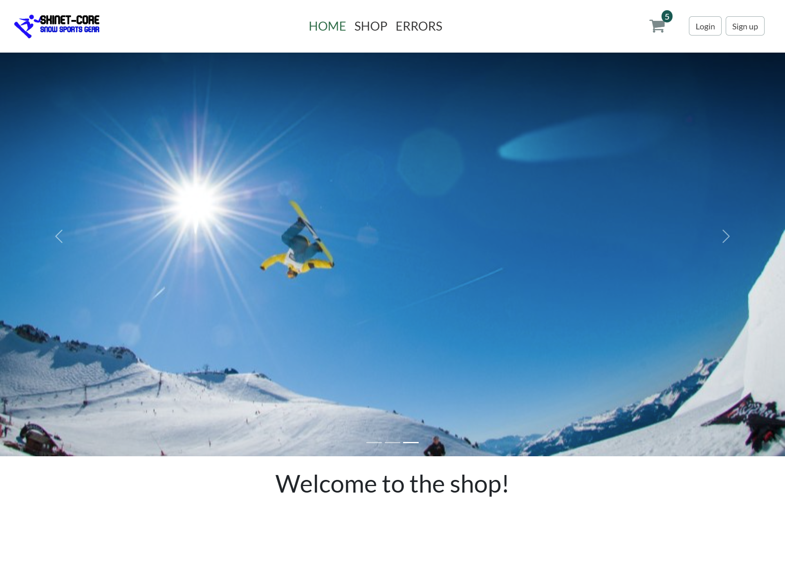
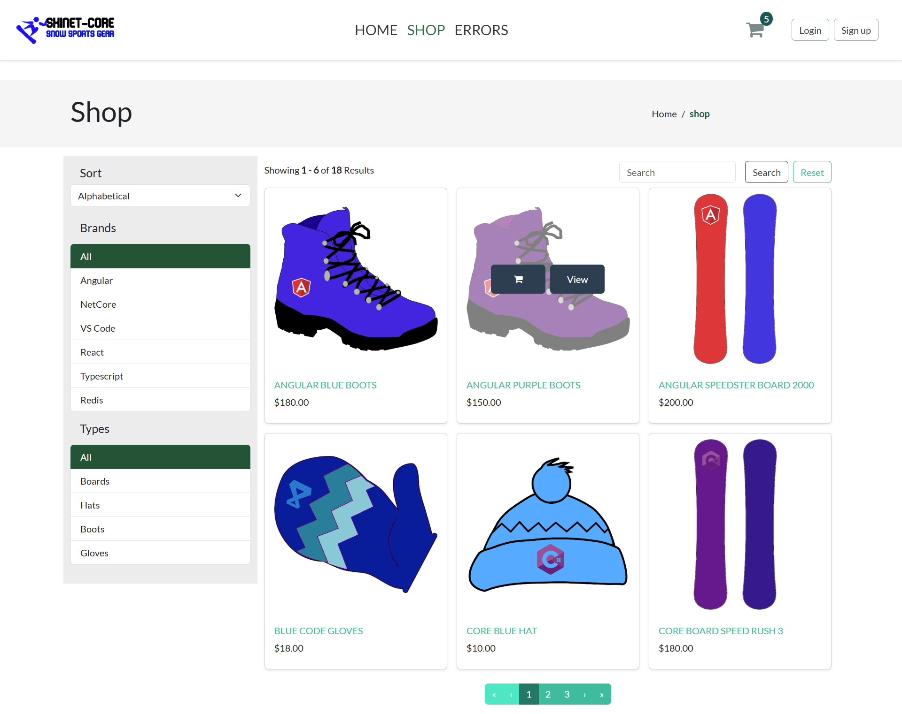
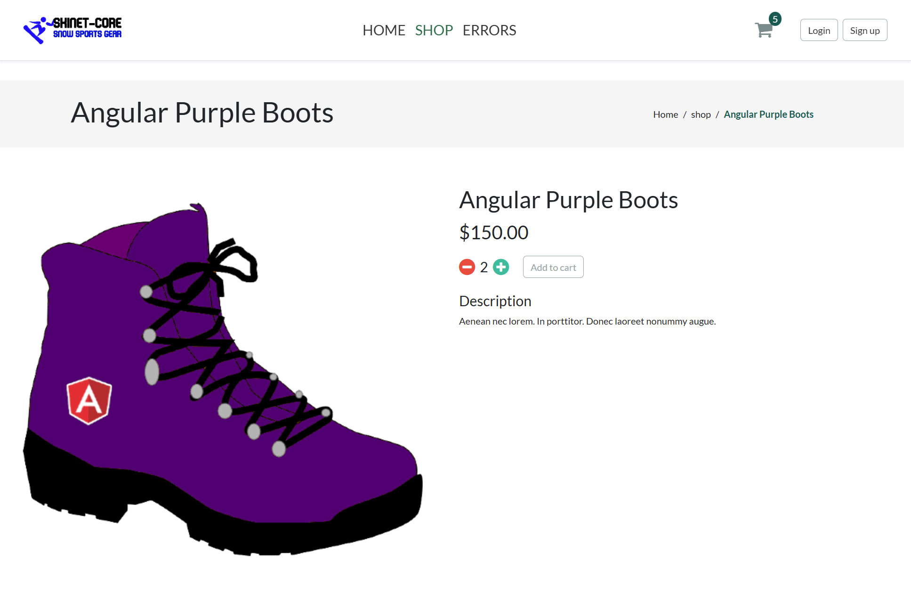

# 🛒 E-Commerce Web Application

A full-stack e-commerce web application built with **ASP.NET Core Web API** (backend) and **Angular** (frontend).  
This project simulates a real-world shopping platform including product listings, cart handling, user accounts, and admin features.

> 🎯 This project was developed based on a full-stack e-commerce course on Udemy, with extended features and personalization and is intended as a **portfolio piece** to demonstrate real-world development using modern technologies and patterns.

---

## 📸 Screenshots

### 🏠 Home Page


### 🛍️ Shop Page


### 📄 Product Details


---

## 🧰 Tech Stack & Tools

| Layer       | Technology                             |
|-------------|-----------------------------------------|
| Frontend    | Angular 17, Angular Material            |
| Backend     | ASP.NET Core 7 Web API                  |
| Database    | SQL Server + Entity Framework Core      |
| Routing     | Angular Router with **Lazy Loading**    |
| Dev Tools   | VS Code, Postman                        |

---

## ⚙️ Getting Started

### 🔧 Prerequisites

- [.NET 7 SDK](https://dotnet.microsoft.com/en-us/download)
- [Node.js 18+](https://nodejs.org/)
- Angular CLI:
  ```bash
  npm install -g @angular/cli
  ```

---

### ▶️ Run Backend (ASP.NET Core API)

```bash
cd backend
dotnet restore
dotnet run
```

API will run at: `https://localhost:5001`

---

### ▶️ Run Frontend (Angular)

```bash
cd frontend
npm install
ng serve --open
```
---

## 📄 License

This project is licensed under the [MIT License](LICENSE).  
Feel free to use, modify, and distribute it with attribution.


App will open at: `http://localhost:4200`

